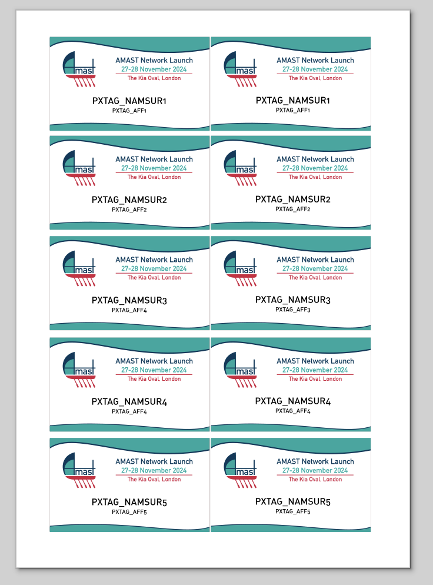

# :name_badge: conference-badges

Generate conference badges based on a list of attendees and an SVG template.

## Data file

A TSV file with a set of columns. For example: **Name**, **Affiliation**.
See [list.tsv](list.tsv) for an example.

Name | Affiliation
--- | ---
Alice | University of Wonderland
Bob | Institute of Bobology


## Template

The template is an SVG file with placeholders for the attendee name and the conference name.
Placeholders should be defined by a prefix and the name of the column.

For example, if the template has a text element the content as `prefix_name1`, the script will replace the content of the text element with the value of the column `name`.

This is because we expect to place multiple badges in the same SVG file, so you can use `prefix_name1`, `prefix_name2`, etc.



:bulb: the default prefix for placeholders is `PXTAG_`.

## Usage

```bash
python namer.py template.svg list.tsv outdir
```

:information_source: If inkscape is in your PATH or in /Applications, the script will also produce PDF files.

```text
usage: namer.py [-h] [--tag TAG] template table output

positional arguments:
  template    SVG template file
  table       CSV table file
  output      Output directory

options:
  -h, --help  show this help message and exit
  --tag TAG   Tag prefix (default: PXTAG_)
```
